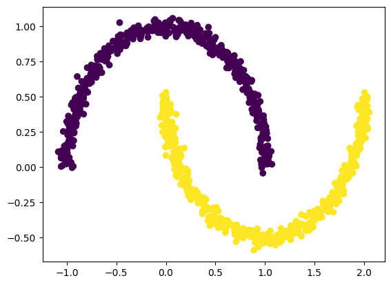
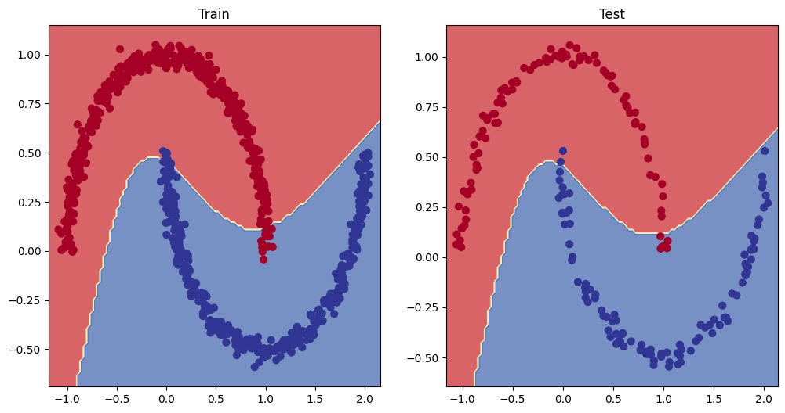
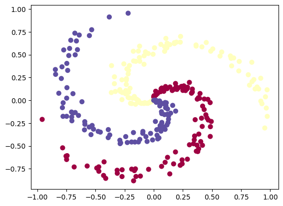
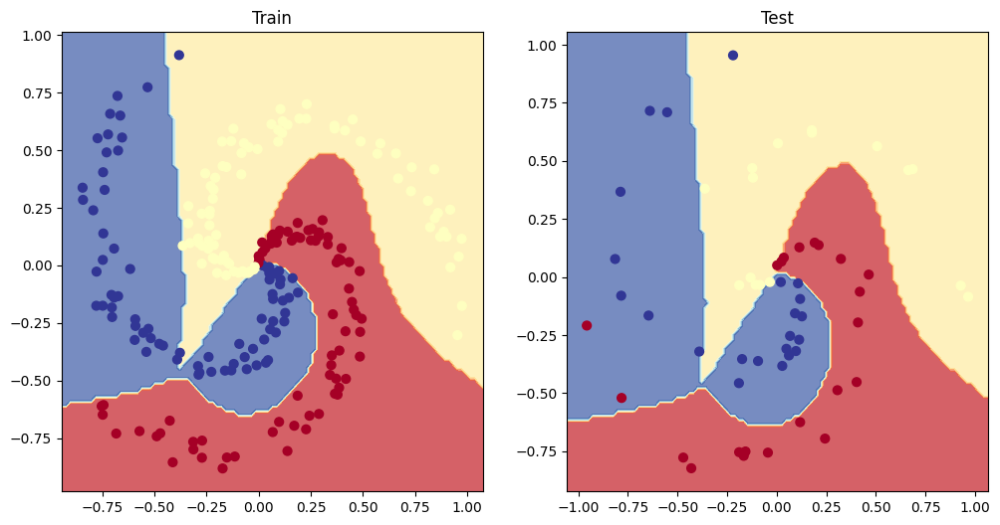

# Basic Classification Problem

In this notebook, I will present simple code snippets using PyTorch to solve classification problems. These examples are designed to serve as a toolbox for tackling real-world classification tasks. By providing straightforward implementations for both binary and multi-class classification, this notebook aims to achieve a quick adaptation of models to various datasets and business requirements. The code includes basic neural network architectures, loss functions, and training routines, which can be easily modified and expanded to meet specific needs.


```python
import torch 
import torch.nn as nn
import pandas as pd
```


```python
from sklearn.datasets import make_moons
n_samples = 1000
X, y = make_moons(n_samples=n_samples, noise = 0.03, random_state=1)
```


```python
# Make DataFrame of circle data
circles = pd.DataFrame({"X1": X[:, 0],
    "X2": X[:, 1],
    "label": y
})
circles.head(10)
```


<div>
<style scoped>
    .dataframe tbody tr th:only-of-type {
        vertical-align: middle;
    }

    .dataframe tbody tr th {
        vertical-align: top;
    }

    .dataframe thead th {
        text-align: right;
    }
</style>
<table border="1" class="dataframe">
  <thead>
    <tr style="text-align: right;">
      <th></th>
      <th>X1</th>
      <th>X2</th>
      <th>label</th>
    </tr>
  </thead>
  <tbody>
    <tr>
      <th>0</th>
      <td>0.040262</td>
      <td>0.421294</td>
      <td>1</td>
    </tr>
    <tr>
      <th>1</th>
      <td>1.412687</td>
      <td>-0.453753</td>
      <td>1</td>
    </tr>
    <tr>
      <th>2</th>
      <td>-0.926203</td>
      <td>0.247305</td>
      <td>0</td>
    </tr>
    <tr>
      <th>3</th>
      <td>-0.683039</td>
      <td>0.765365</td>
      <td>0</td>
    </tr>
    <tr>
      <th>4</th>
      <td>0.040528</td>
      <td>1.042990</td>
      <td>0</td>
    </tr>
    <tr>
      <th>5</th>
      <td>1.878351</td>
      <td>0.084499</td>
      <td>1</td>
    </tr>
    <tr>
      <th>6</th>
      <td>-0.053018</td>
      <td>0.992714</td>
      <td>0</td>
    </tr>
    <tr>
      <th>7</th>
      <td>1.413340</td>
      <td>-0.411889</td>
      <td>1</td>
    </tr>
    <tr>
      <th>8</th>
      <td>-0.467140</td>
      <td>1.027198</td>
      <td>0</td>
    </tr>
    <tr>
      <th>9</th>
      <td>0.972252</td>
      <td>0.306843</td>
      <td>0</td>
    </tr>
  </tbody>
</table>
</div>


```python
circles.label.value_counts()
```


    label
    1    500
    0    500
    Name: count, dtype: int64


The problem above is a binary classification problem. Let us visualize the data.


```python
# Visualize with a plot
import matplotlib.pyplot as plt
plt.scatter(x=X[:, 0], 
            y=X[:, 1], 
            c=y);
```


    
<!--  -->

    


This is a common data that is used to show the issue of commonly used classification tools like K-means and SVM


```python
# Check the shapes of our features and labels
X.shape, y.shape
```


    ((1000, 2), (1000,))


```python
# Turn data into tensors
X = torch.from_numpy(X).type(torch.float)
y = torch.from_numpy(y).type(torch.float)

# View the first five samples
X[:5], y[:5]
```


    (tensor([[ 0.0403,  0.4213],
             [ 1.4127, -0.4538],
             [-0.9262,  0.2473],
             [-0.6830,  0.7654],
             [ 0.0405,  1.0430]]),
     tensor([1., 1., 0., 0., 0.]))


```python
# Split data into train and test sets
from sklearn.model_selection import train_test_split

X_train, X_test, y_train, y_test = train_test_split(X, 
                                                    y, 
                                                    test_size=0.2, # 20% test, 80% train
                                                    random_state=42) # make the random split reproducible

len(X_train), len(X_test), len(y_train), len(y_test)
```


    (800, 200, 800, 200)


```python
device = "cuda" if torch.cuda.is_available() else "cpu"
```


```python
# 1. Construct a model class that subclasses nn.Module
class ClassificationModelV1(nn.Module):
    def __init__(self):
        super().__init__()
        # 2. Create 2 nn.Linear layers capable of handling X and y input and output shapes
        self.layer_1 = nn.Linear(in_features=2, out_features=20, bias = True) # takes in 2 features (X), produces 5 features
        self.layer_2 = nn.Linear(in_features=20, out_features=10, bias = True) # takes in 5 features, produces 1 feature (y)
        self.gelu = nn.GELU()
        self.layer_4 = nn.Linear(10, 1, bias = True)
    # 3. Define a forward method containing the forward pass computation
    def forward(self, x):
        # Return the output of layer_2, a single feature, the same shape as y
        x = self.layer_1(x)
        x = self.gelu(x)
        x = self.layer_2(x)
        x = self.gelu(x)
        x = self.layer_4(x)
        return x # computation goes through layer_1 first then the output of layer_1 goes through layer_2

# 4. Create an instance of the model and send it to target device
model_0 = ClassificationModelV1().to(device)
model_0
```


    ClassificationModelV1(
      (layer_1): Linear(in_features=2, out_features=20, bias=True)
      (layer_2): Linear(in_features=20, out_features=10, bias=True)
      (gelu): GELU(approximate='none')
      (layer_4): Linear(in_features=10, out_features=1, bias=True)
    )


```python
# Make predictions with the model
untrained_preds = model_0(X_test.to(device))
untrained_preds
```


```python
import matplotlib.pyplot as plt
plt.scatter(x=X_test[:, 0].cpu().detach(), 
            y=X_test[:, 1].cpu().detach(), 
            c=torch.round(torch.sigmoid(untrained_preds.cpu().detach())));
```


    
<!--  -->

    


```python
loss_fn = nn.BCEWithLogitsLoss()
optimizer = torch.optim.SGD(params = model_0.parameters(), lr=0.01)
```


```python
def accuracy_fn(preds, y):
    correct = torch.eq(y, preds).sum().item()
    acc = correct/len(preds) * 100
    return acc
```


```python
torch.manual_seed(42)

# Set the number of epochs
epochs = 10000

# Put data to target device
X_train, y_train = X_train.to(device), y_train.to(device)
X_test, y_test = X_test.to(device), y_test.to(device)

# Build training and evaluation loop
for epoch in range(epochs):
    ### Training
    model_0.train()

    # 1. Forward pass (model outputs raw logits)
    y_logits = model_0(X_train).squeeze() # squeeze to remove extra `1` dimensions, this won't work unless model and data are on same device 
    y_pred = torch.round(torch.sigmoid(y_logits)) # turn logits -> pred probs -> pred labls
  
    # 2. Calculate loss/accuracy
    # loss = loss_fn(torch.sigmoid(y_logits), # Using nn.BCELoss you need torch.sigmoid()
    #                y_train) 
    loss = loss_fn(y_logits, # Using nn.BCEWithLogitsLoss works with raw logits
                   y_train) 
    acc = accuracy_fn(y_pred, y_train) 

    # 3. Optimizer zero grad
    optimizer.zero_grad()

    # 4. Loss backwards
    loss.backward()

    # 5. Optimizer step
    optimizer.step()

    ### Testing
    model_0.eval()
    with torch.inference_mode():
        # 1. Forward pass
        test_logits = model_0(X_test).squeeze() 
        test_pred = torch.round(torch.sigmoid(test_logits))
        # 2. Caculate loss/accuracy
        test_loss = loss_fn(test_logits,
                            y_test)
        test_acc = accuracy_fn(test_pred, y_test)

    # Print out what's happening every 10 epochs
    if epoch % 10 == 0:
        print(f"Epoch: {epoch} | Loss: {loss:.5f}, Accuracy: {acc:.2f}% | Test loss: {test_loss:.5f}, Test acc: {test_acc:.2f}%")
```


```python
import requests
from pathlib import Path 

# Download helper functions from Learn PyTorch repo (if not already downloaded)
if Path("helper_functions.py").is_file():
  print("helper_functions.py already exists, skipping download")
else:
  print("Downloading helper_functions.py")
  request = requests.get("https://raw.githubusercontent.com/mrdbourke/pytorch-deep-learning/main/helper_functions.py")
  with open("helper_functions.py", "wb") as f:
    f.write(request.content)

from helper_functions import plot_predictions, plot_decision_boundary
```

    helper_functions.py already exists, skipping download


```python
# Plot decision boundaries for training and test sets
plt.figure(figsize=(12, 6))
plt.subplot(1, 2, 1)
plt.title("Train")
plot_decision_boundary(model_0, X_train, y_train)
plt.subplot(1, 2, 2)
plt.title("Test")
plot_decision_boundary(model_0, X_test, y_test)
```


    
<!--  -->

    


```python
# 1. Construct a model class that subclasses nn.Module
class MultiClassificationModelV1(nn.Module):
    def __init__(self, in_features, out_features):
        super().__init__()
        # 2. Create 2 nn.Linear layers capable of handling X and y input and output shapes
        self.layer_1 = nn.Linear(in_features=in_features, out_features=10, bias = True) # takes in 2 features (X), produces 5 features
        self.layer_2 = nn.Linear(in_features=10, out_features=10, bias = True) # takes in 5 features, produces 1 feature (y)
        self.gelu = nn.GELU()
        self.layer_4 = nn.Linear(10, out_features, bias = True)
    # 3. Define a forward method containing the forward pass computation
    def forward(self, x):
        # Return the output of layer_2, a single feature, the same shape as y
        x = self.layer_1(x)
        x = self.gelu(x)
        x = self.layer_2(x)
        x = self.gelu(x)
        x = self.layer_4(x)
        return x # computation goes through layer_1 first then the output of layer_1 goes through layer_2

# 4. Create an instance of the model and send it to target device
model_1 = MultiClassificationModelV1(in_features=2, out_features=4).to(device)
model_1
```


    MultiClassificationModelV1(
      (layer_1): Linear(in_features=2, out_features=10, bias=True)
      (layer_2): Linear(in_features=10, out_features=10, bias=True)
      (gelu): GELU(approximate='none')
      (layer_4): Linear(in_features=10, out_features=4, bias=True)
    )


```python
import numpy as np
N = 100 # number of points per class
D = 2 # dimensionality
K = 3 # number of classes
X = np.zeros((N*K,D)) # data matrix (each row = single example)
y = np.zeros(N*K, dtype='uint8') # class labels
for j in range(K):
  ix = range(N*j,N*(j+1))
  r = np.linspace(0.0,1,N) # radius
  t = np.linspace(j*4,(j+1)*4,N) + np.random.randn(N)*0.2 # theta
  X[ix] = np.c_[r*np.sin(t), r*np.cos(t)]
  y[ix] = j
# lets visualize the data
plt.scatter(X[:, 0], X[:, 1], c=y, s=40, cmap=plt.cm.Spectral)
plt.show()
X = torch.from_numpy(X).type(torch.float).to(device)
y = torch.from_numpy(y).type(torch.long).to(device)

```


    
<!--  -->

    


```python
X_train, X_test, y_train, y_test = train_test_split(X, 
                                                    y, 
                                                    test_size=0.2, # 20% test, 80% train
                                                    random_state=42) # make the random split reproducible

len(X_train), len(X_test), len(y_train), len(y_test)
```


    (240, 60, 240, 60)


```python
optimizer = torch.optim.SGD(model_1.parameters(), lr = 0.01)
loss_fn = nn.CrossEntropyLoss()
num_epochs = 20000

for epoch in range(num_epochs):
    train_logits = model_1(X_train)
    y_pred = torch.softmax(train_logits, dim=1).argmax(dim=1)
    loss = loss_fn(train_logits.float(), y_train.long())
    acc = accuracy_fn(y_pred, y_train)
    
    optimizer.zero_grad()
    loss.backward()
    optimizer.step()
    model_1.eval()
    with torch.inference_mode():
        test_logits = model_1(X_test)
        test_pred = torch.softmax(test_logits, dim=1).argmax(dim=1)
        test_loss = loss_fn(test_logits, y_test)
        test_acc = accuracy_fn(test_pred, y_test)
        
    if epoch % 10 == 0:
        print(f"Epoch: {epoch} | Loss: {loss:.5f}, Accuracy: {acc:.2f}% | Test loss: {test_loss:.5f}, Test acc: {test_acc:.2f}%")
```


```python
plt.figure(figsize=(12, 6))
plt.subplot(1, 2, 1)
plt.title("Train")
plot_decision_boundary(model_1, X_train, y_train)
plt.subplot(1, 2, 2)
plt.title("Test")
plot_decision_boundary(model_1, X_test, y_test)
```


    
<!--  -->

    


## Summary

- For binary classification problems, use `nn.BCEWithLogitsLoss()`. This function accepts logits directly from the model, eliminating the need for a `torch.sigmoid()` step.
- Adding GELU or ReLU activation functions can introduce non-linearity to the classification boundaries. If the true labels can be separated by linear boundaries (as determined by visualization), using ReLU might not be necessary to achieve successful results.
- GELU activation can cause the model to converge more slowly compared to using ReLU.
- For multi-class classification problems, use `nn.CrossEntropyLoss()` as the loss function.
